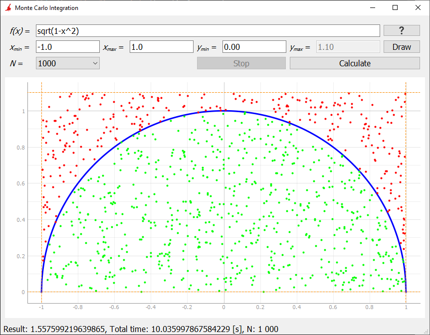
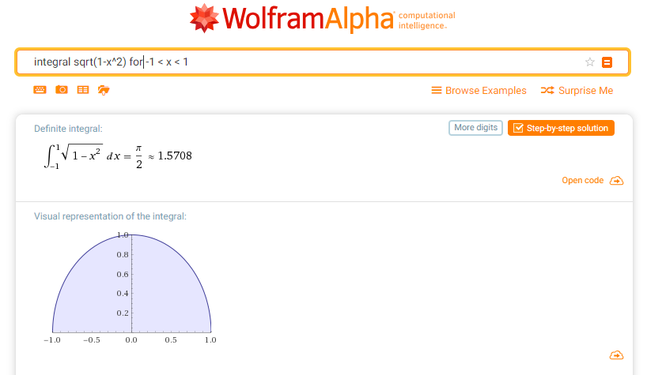
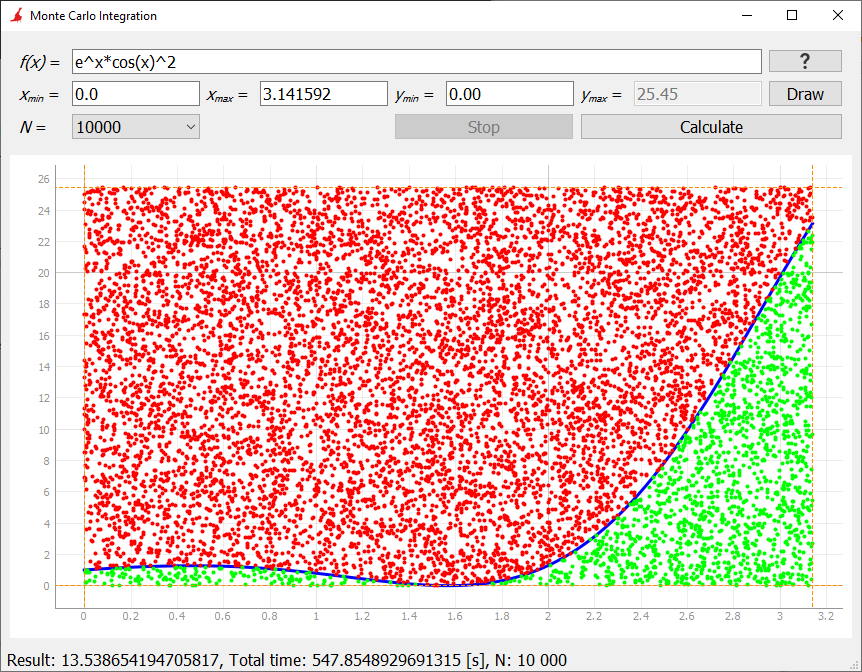

# Monte Carlo Integration - Examples

## Example #1 - Approximation of PI number
<table>
	<tr>
		<td>Function:</td>
		<td></td>
	</tr>
	<tr>
		<td>Limits of integration:</td>
		<td></td>
	</tr>
	<tr>
		<td>Integral:</td>
		<td></td>
	</tr>
</table>

Code:

```python
if __name__ == '__main__':
	function = 'sqrt(1-x^2)'
	xmin = -1
	xmax = 1
	ymin = 0
	N = 1000
```
### App view


### Monte Carlo integration result
<table>
	<tr>
		<th></th>
		<th>Analytic</th>
		<th colspan="3">Python</th>
		<th colspan="3">Arduino</th>
	</tr>
	<tr>
		<td>N</td>
		<td></td>
		<td>100</td>
		<td><b>1000</td>
		<td>10000</td>
		<td>100</td>
		<td>1000</td>
		<td><b>10000</b></td>
	</tr>
	<tr>
    	<td>Value</td>
    	<td>3.14 / 2 = 1.57</td>
   		<td>1.54</td>
    	<td><b>1.56</b></td>
    	<td>1.56</td>
		<td>1.63</td>
   		<td>1.55</td>
    	<td><b>1.56</b></td>
  	</tr>
	<tr>
		<td>Abs error</td>
		<td></td>
   		<td>0.03</td>
    	<td><b>0.01</b></td>
    	<td>0.01</td>
		<td>0.13</td>
   		<td>0.02</td>
    	<td><b>0.01</b></td>
	</tr>
	<tr>
		<td>Rel error [%]</td>
		<td></td>
   		<td>1.91</td>
    	<td><b>0.63</b></td>
    	<td>0.63</td>
		<td>-4.40</td>
   		<td>0.68</td>
    	<td><b>0.36</b></td>
	</tr>
</table>

### WolframAlpha result
 

## Example #2
<table>
	<tr>
		<td>Function:</td>
		<td></td>
	</tr>
	<tr>
		<td>Limits of integration:</td>
		<td></td>
	</tr>
	<tr>
		<td>Integral:</td>
		<td></td>
	</tr>
</table>

### Code

```python
if __name__ == '__main__':
	function = 'e^x*cos(x)^2'
	xmin = 0
	xmax = 3.141592
	ymin = 0
	N = 1000
```
### App view


### Monte Carlo integration result
<table>
	<tr>
		<th></th>
		<th>Analytic</th>
		<th colspan="3">Python</th>
		<th colspan="3">Arduino</th>
	</tr>
	<tr>
		<td>N</td>
		<td></td>
		<td>100</td>
		<td>1000</td>
		<td><b>10000</b></td>
		<td>100</td>
		<td><b>1000</b></td>
		<td>10000</td>
	</tr>
	<tr>
    	<td>Value</td>
    	<td>13.284</td>
    	<td>9.589</td>
    	<td>11.275</td>
    	<td><b>13.358</b></td>
   		<td>17.448</td>
    	<td><b>12.868</b></td>
    	<td>12.861</td>
  	</tr>
	<tr>
		<td>Abs error</td>
		<td></td>
   		<td>3.695</td>
    	<td>2.001</td>
    	<td><b>0.074</b></td>
		<td>4.168</td>
   		<td><b>0.412</b></td>
    	<td>0.419</td>
	</tr>
	<tr>
		<td>Rel error [%]</td>
		<td></td>
   		<td>27.81</td>
    	<td>15.06</td>
    	<td><b>-0.55</b></td>
		<td>-31.38</td>
   		<td><b>3.11</b></td>
    	<td>3.15</td>
	</tr>
</table>

### WolframAlpha result
 

### Integration step-by-step
 

