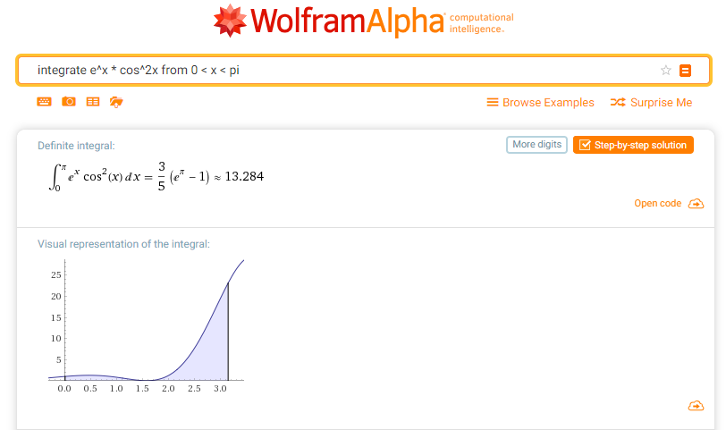

# Monte Carlo Integration - Examples

## Example #1
<table>
	<tr>
		<td>Function:</td>
		<td></td>
	</tr>
	<tr>
		<td>Limits of integration:</td>
		<td></td>
	</tr>
	<tr>
		<td>Integral:</td>
		<td></td>
	</tr>
</table>

Code:

```python
if __name__ == '__main__':
	function = 'e^x*cos(x)^2'
	xmin = 0
	xmax = 3.141592
	ymin = 0
	N = 1000
```

### Monte Carlo integration result
<table>
  <tr>
    <th></th>
    <th>Analytic</th>
    <th colspan="3">Python</th>
    <th colspan="3">Arduino</th>
  </tr>
  <tr>
    <td>N</td>
    <td></td>
    <td>100</td>
    <td>1000</td>
    <td>10000</td>
    <td>100</td>
    <td>1000</td>
    <td>10000</td>
  </tr>
  <tr>
    <td>Value</td>
    <td>13.284</td>
    <td>9.589</td>
    <td>11.275</td>
    <td></td>
    <td></td>
    <td></td>
    <td></td>
  </tr>
</table>

### WolframAlpha result
 

### Integration step-by-step
 
